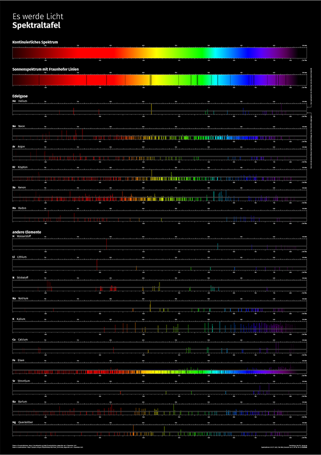

## Es werde Licht
# Spektraltafel

Mit TeX erstellte Spaktraltafel im Format DIN A0 (+ 3mm Anschnitt umlaufend).

→ [Spektraltafel, v1.2 (PDF, DIN A0, CMYK)](https://github.com/tweh/spektrallinien/raw/master/versionen/spektraltafel_v1.2.pdf)  
→ [Spektraltafel, v1.2 (PDF, DIN A4, RGB)](https://github.com/tweh/spektrallinien/raw/master/versionen/spektraltafel_v1.2_a4_rgb.pdf)  
→ [Spektraltafel, v1.2 (PDF, DIN A4, RGB, gerastert)](https://github.com/tweh/spektrallinien/raw/master/versionen/spektraltafel_v1.2_rgb_rendered.pdf) in dieser Version ist die Seite als gerasterte Pixeldatei gespeichert, falls PDF-Betrachter das Anzeigen der Grafiken nicht bewältigen können.  
→ [Spektraltafel, v1.2 (PNG, RGB)](https://github.com/tweh/spektrallinien/raw/master/versionen/spektraltafel_v1.2_highres.pdf) in dieser Version ist die Seite als gerasterte Pixeldatei gespeichert, falls PDF-Betrachter das Anzeigen der Grafiken nicht bewältigen können.

## Quellen

- Daten zu Fraunhoferlinien: <https://de.wikipedia.org/wiki/Fraunhoferlinie>, abgerufen am 5. Dezember 2021.
- Daten zu Spektrallinien: <https://physics.nist.gov/PhysRefData/ASD/lines_form.html>, abgerufen am 4. Dezember 2021

## Versionen

- `v1.0`: initiale Version

- `v1.1`:
  - Dateien umbenannt
  - Überschrift geändert

- `v1.2`:
  - auf CMYK umgestellt (für Druck)
  - CC-Icons ausgerichtet

- `v1.2a`:
  - A4 Version und höher aufgelöste PNG ergänzt

## Lizenz

[Spektrallinien ](https://github.com/tweh/spektrallinien) © 2021 by  [Tobi Weh ](https://herrw.de/) is licensed under  [CC BY-NC-SA 4.0](http://creativecommons.org/licenses/by-nc-sa/4.0/?ref=chooser-v1)