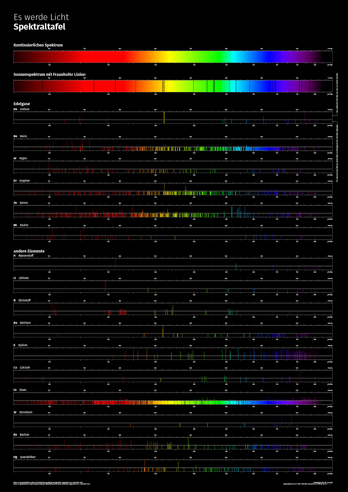

## Es werde Licht
# Spektraltafel

Mit TeX erstellte Spaktraltafel im Format DIN A0 (+ 3mm Anschnitt umlaufend).

→ [Spektraltafel, v1.1 (PDF)](https://github.com/tweh/spektrallinien/raw/master/versionen/spektraltafel_v1.1.pdf)

## Quellen

- Daten zu Fraunhoferlinien: <https://de.wikipedia.org/wiki/Fraunhoferlinie>, abgerufen am 5. Dezember 2021.
- Daten zu Spektrallinien: <https://physics.nist.gov/PhysRefData/ASD/lines_form.html>, abgerufen am 4. Dezember 2021

## Versionen

- `v1.0`: initiale Version

## Lizenz

[Spektrallinien ](https://github.com/tweh/spektrallinien) © 2021 by  [Tobi Weh ](https://herrw.de/) is licensed under  [CC BY-NC-SA 4.0](http://creativecommons.org/licenses/by-nc-sa/4.0/?ref=chooser-v1)